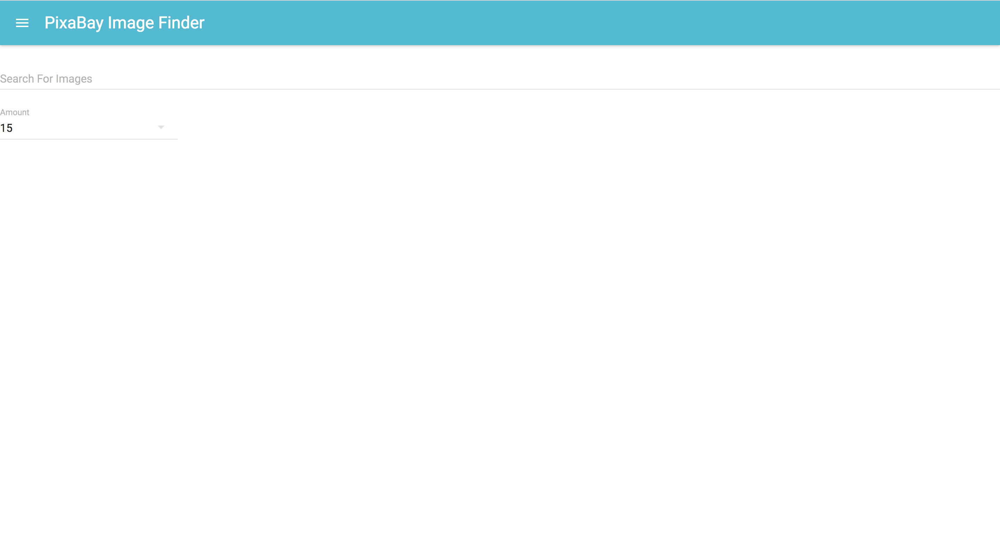

# React-Material-UI-
Pixabay mini project 

Installation Instructions
1. Clone repo
2. CD into directory 
3. Install dependancies
4. CD in src folder and run yarn start

</a>

This is a React app where you can search Pixabays API for photos based on what you enter in the search field. There is an option for the amount of photos you wish to view in your results from thr dropdown menu. This app has been styled using Material UI.
